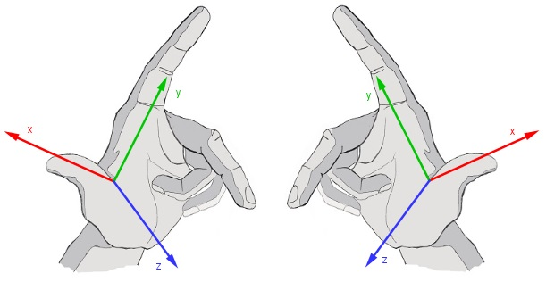

# 座標係

在3D遊戲開發中，使用左手坐標系還是右手坐標系取決於所使用的圖形引擎或開發環境。不同的工具和庫可能採用不同的坐標系統。以下是一些常見的圖形引擎和它們所使用的坐標系：

## 右手坐標系：

- DirectX：這是微軟開發的一套圖形API，廣泛用於Windows平台上的遊戲開發。DirectX 使用右手坐標系。
- OpenGL：廣泛用於跨平台的圖形程序開發。OpenGL 傳統上使用右手坐標系，但它足夠靈活，開發者可以配置它使用左手坐標系。
- Vulkan：這是一個較新的跨平台圖形API，由Khronos Group開發，旨在提供更高的效率和更好的硬件抽象。Vulkan 使用右手坐標系。

左手坐標系：

- Unity：這是一個流行的遊戲開發平台，被廣泛用於開發各種平台的遊戲。Unity 使用左手坐標系。
- Unreal Engine：這是另一個非常流行的遊戲開發引擎，廣泛用於開發高質量的遊戲和虛擬現實應用。Unreal Engine 使用左手坐標系。

Picture
]
